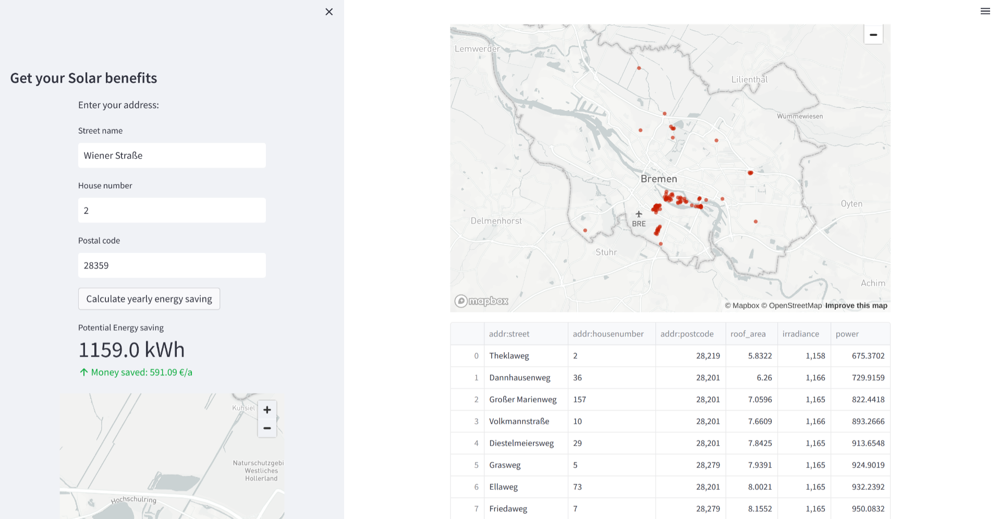

# [TUM.ai](https://www.tum-ai.com) Makeathon 2023

For this AI hackathon, we built a solar panel opportunity visualization platform, which is composed of a frontend website (made using [streamlit](https://streamlit.io/)), which displays information such as solar benefits for a specific user-provided house address, as well as an interactive map visualizing overall solar opportunities in an area, and a backend REST API (made using [Flask](https://flask.palletsprojects.com)) for the frontend to call to obtain the data for individual houses.

## The challenge
Out of the five possible challenges, we chose to work on the Solar Oppurtunities in Germany project presented by [genistat](https://genistat.ch).

**The future of energy is green!**

### Status Quo

To accelerate the clean energy revolution, we must use the resources we have in the most effective manner. Last year, 50% more solar panels were installed on German roofs than the year before. While this is great news, it does not paint the full picture. Due to supply chain limitations and skill shortages, most homeowners in Germany have to wait up to 1 year for a consultation appointment with solar roof experts. For an installation, the waiting periods are even crazier: Waiting times of 2-3 years before a solar roof can be installed have become the new normal. The current solar market does not scale with the demand!

That's why we must ensure that the limited solar panel resources we have are used in the most efficient way possible! Sadly, the current system is quite the opposite. Solar construction companies serve their customers on a first-come-first-serve basis: Whoever requests the solar panel first gets the panel installed first.

### Challenge:

To optimize the welfare across Germany, we should turn this process around and first evaluate which houses in Germany are best suited for solar panels. Then, we should panel the best-suited houses first, getting the most efficiency out of each newly installed panel, before moving on to less optimal houses.

Come up with a system that can distribute solar panels in a way that maximizes the clean energy production of a country.

### Objectives:

Your solution could answer the following questions:

- How many German roofs must be equipped with solar panels to substitute all of Germany's fossil energy sources?
- In which German regions should solar be subsidized the most?
- Where are the 100 buildings in Germany with the largest roofs and the best efficiency per square meter?
- How much electricity can the homeowner of the house at the location long/lat produce per year?

The extra mile:

- Is the roof of a candidate building even suitable for solar panels, or are windows or chimneys blocking the roof area?
- Are other buildings, vegetation, or even mountains casting large shadows onto a candidate building?

### Data

Different datasets, implementation hints that could be useful for your solution:
[https://github.com/polygon-software/tum.ai-solar](https://github.com/polygon-software/tum.ai-solar)

## How to run

<!-- Our system is split into a frontend website (made using [streamlit](https://streamlit.io/)) and a backend REST API (made using [Flask](https://flask.palletsprojects.com)). -->

1. First, install all Python dependencies, specified in [`requirements.txt`](./requirements.txt), with `pip install -r requirements.txt`.
2. Run the backend with `python database.py`. This will take a while, as we had to improvise and use panda dataframes as our "database", since we couldn't get [TinyDB](https://tinydb.readthedocs.io) to work in time (when we tried to use it, all API requests returned nothing for some reason).
3. Run the frontend with `streamlit run main.py`.
